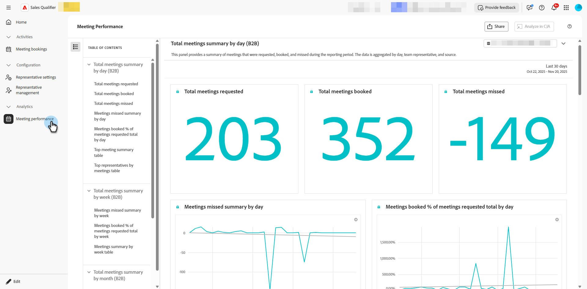

# Encontros {#meetings}

Conheça todas as suas configurações de _Reunião_ no Adobe Brand Concierge. Conecte seu calendário, defina a disponibilidade, visualize análises e muito mais.

>[!NOTE]
>
>Você também pode assistir a um vídeo [Marcar uma reunião](../getting-started/meeting-booking.md).

## Configuração {#configuration}

Conecte-se à sua conta do Outlook ou do Google e determine várias configurações, como dia da semana, fuso horário e duração da reunião.

### Conectar seu calendário {#connect}

1. Faça logon no [Adobe Experience Platform](https://experience.adobe.com/){target="_blank"}.

1. Selecione **[!UICONTROL Qualificador de Vendas]**.

   {width="800" zoomable="yes"}

1. Em _Configuração_, clique em **Configurações de perfil**. Na guia **[!UICONTROL Configuração do calendário]**, escolha o calendário desejado.

   

1. Escolha uma conta já conectada ou adicione uma nova.

   

1. Após a conclusão da conexão, especifique o conteúdo de email desejado.

   Esse é o conteúdo que é enviado ao recipient quando ele reserva uma reunião com você. Também é possível incluir um link de reunião do Microsoft Teams (opcional).

   

1. Clique em **[!UICONTROL Salvar]**.

### Definir disponibilidade do calendário {#calendar-availability}

1. Clique na guia **[!UICONTROL Disponibilidade do calendário]**.

   

1. Escolha as configurações desejadas.

   >[!NOTE]
   >
   >Para adicionar mais opções de tempo, clique no sinal de mais ().

   

1. Clique em **[!UICONTROL Salvar]**.

### Definir disponibilidade do chat ao vivo {#chat-availability}

1. Clique na guia **[!UICONTROL Disponibilidade do chat ao vivo]** e escolha as configurações desejadas. Clique em **Salvar** ao concluir.

   

### Gerenciar membros {#manage}

**Somente administradores**. Veja qual de seus representantes conectou o calendário com êxito.

## Atividades {#activities}

Clique em **[!UICONTROL Reservas da reunião]** para analisar reuniões que foram reservadas, ver quais informações foram capturadas, saber quando a reunião foi agendada e muito mais.

### Página da reunião {#bookings}

{width="800" zoomable="yes"}

## Analytics {#analytics}

Clique em **[!UICONTROL Desempenho da reunião]** para analisar várias categorias de análise diferentes, incluindo quantos visitantes solicitaram reuniões e quantos foram perdidos. Você pode ver qual tem sido a tendência das reuniões, quem são os representantes que fizeram as reuniões, e muito mais.

### Página Reuniões {#performance}

{width="800" zoomable="yes"}
